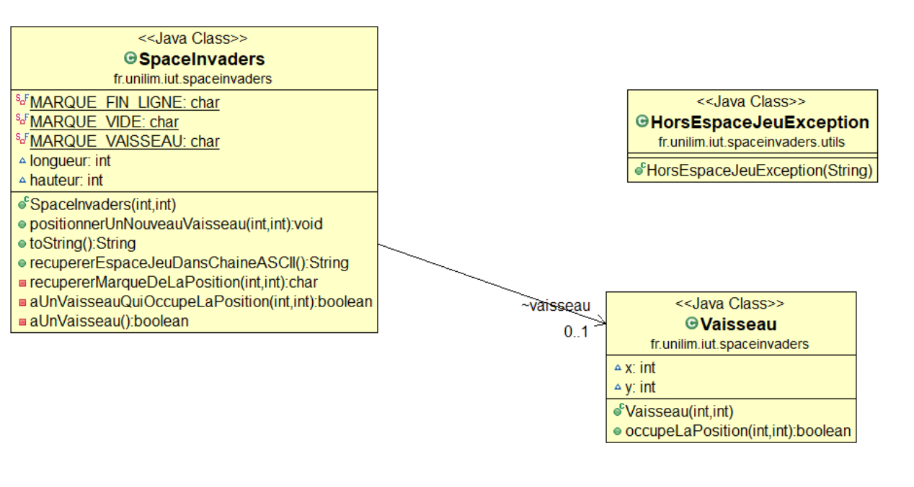

# spaceinvaders

Jamaleddine Ali

Rapport Hébdomadaire : 

# Semaine du 03/05/19 au 07/05/19

Recherche critéres d'acceptance :

1.Critères d'acceptance de la story : 

1-Positionner un nouveau vaisseau dans l'espace de jeu : 

critère 1 : Existence d'espace de jeu 
critère 2 : Existence vaisseau

2-Faire déplacer le vaisseau vers la droite ou gauche

critère 1 : Existence espace de jeu 
critère 2 : Existence vaisseau 
critère 3 : Capacité deplacement vaisseau 

# Fonctionalités mises en place : 

Story n° 1 :Créer un espace de jeu

Story n° 2 : Positionner un nouveau vaisseau dans l'espace de jeu

En cours : Test : Le nouveau vaisseau ne peut pas être positionné en dehors de l'espace

# Diagramme de classes 

# Nuage de mots

J'ai eu quelques problèmes avec Eclipse, j'ai du tout réinstaller et refaire tout les TP ce qui m'a retardé. Je tacherai de prendre de l'avance durant les prochains TP et mon temps libre.

---

# Semaine du 07/05/2019 au 14/05/2019

Suite fonctionalité 1 : 

Story n° 3 : Déplacer le vaisseau vers la droite dans l'espace de jeu

Story n°4 :  Déplacer le vaisseau vers la gauche dans l'espace de jeu

En cours : Fonctionalité 2

# Diagramme de classes 

# Nuage de mots

---

# Semaine du 14/05/2019 au 22/05/2019

Fonctionalité 2 : 

Etape n°1 : Positionner un nouveau vaisseau avec une dimension donnée

étape n°2 :

# Diagramme de classes 

# Nuage de mots

//Une reinstallation d'eclipse pour les Tp d'IHM a posé quelques problèmes

# Semaine du 22/05/2019 au 29/05/2019

Avancement : 
Fonctionalité 4 : 
-Tirer un missile en TDD

En cours : -Dessiner un missile

# Diagramme de classes 

# Nuage de mots

